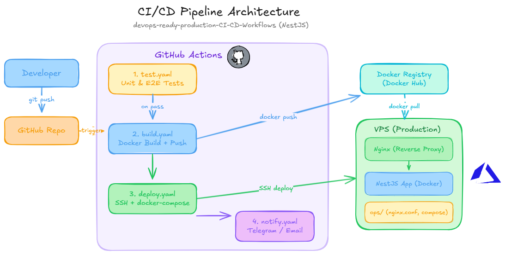

# Multi-Environment CI/CD Workflow (NestJS + Docker Hub + VPS)



This repository is configured for a three-environment deployment flow:

1. Run CI checks in GitHub Actions.
2. Merge `feature/*` into `develop` to auto-deploy `dev`.
3. Promote tested changes from `develop` to `staging` to auto-deploy `staging`.
4. Merge release-ready code from `staging` to `main`.
5. Deploy `production` manually with approval and an immutable image tag.

## Architecture

- App image: `docker.io/<DOCKERHUB_USERNAME>/devops-tutorial:<tag>`
- Dev compose file: `docker-compose.dev.yml`
- Staging compose file: `docker-compose.staging.yml`
- Production compose file: `docker-compose.prod.yml`
- VPS deploy script: `ops/deploy.sh`
- CI/CD workflows:
  - `.github/workflows/test.yaml`
  - `.github/workflows/build.yaml`
  - `.github/workflows/deploy-dev.yaml`
  - `.github/workflows/deploy-staging.yaml`
  - `.github/workflows/deploy-production.yaml`
  - `.github/workflows/cleanup-dockerhub.yaml`

## Branch Flow

- `feature/*` -> open PR into `develop`
- `develop` -> auto deploy `dev`
- `staging` -> auto deploy `staging`
- `main` -> release-ready branch for production promotion

Recommended promotion path:

1. Merge feature PR into `develop`
2. Validate on `dev`
3. Open PR from `develop` to `staging`
4. Validate on `staging`
5. Open PR from `staging` to `main`
6. Manually deploy `production` with the approved `sha-*` or `vX.Y.Z` tag

## Local Development

```bash
pnpm install
pnpm run start:dev
```

## Build and Run Locally with Docker

```bash
docker build -t devops-tutorial:local .
docker run --rm -p 3000:3000 devops-tutorial:local
```

## VPS One-Time Setup

Run once on VPS:

```bash
sudo apt-get update
sudo apt-get install -y docker.io docker-compose-plugin git
sudo usermod -aG docker "$USER"
newgrp docker
```

Clone project and create environment files:

```bash
git clone <your-repo-url>
cd devops-ready-production-CI-CD-Workflows
cp ops/.env.dev.example ops/.env.dev
cp ops/.env.staging.example ops/.env.staging
cp ops/.env.production.example ops/.env.production
```

Update `ops/.env.dev`:

```dotenv
DOCKERHUB_USERNAME=your-dockerhub-username
IMAGE_TAG=latest
APP_PORT=3002
```

Update `ops/.env.staging`:

```dotenv
DOCKERHUB_USERNAME=your-dockerhub-username
IMAGE_TAG=sha-<validated_staging_commit_sha>
APP_PORT=3001
```

Update `ops/.env.production`:

```dotenv
DOCKERHUB_USERNAME=your-dockerhub-username
IMAGE_TAG=sha-<validated_commit_sha>
APP_PORT=3000
```

Manual deploy on VPS:

```bash
DEPLOY_ENV=dev ./ops/deploy.sh
DEPLOY_ENV=staging ./ops/deploy.sh
DEPLOY_ENV=production ./ops/deploy.sh
```

## GitHub Repository Configuration

Set repository **Variables**:

- `DOCKERHUB_USERNAME`: your Docker Hub username
- `DOCKERHUB_CLEANUP_ENABLED`: set to `true` only after validating a manual cleanup dry run
- `DOCKERHUB_PROTECTED_TAGS`: optional comma-separated `sha-*` tags to never delete

Set repository **Secrets**:

- `DOCKERHUB_TOKEN`: Docker Hub access token
- `DOCKERHUB_DELETE_TOKEN`: Docker Hub PAT with `Delete` permission for cleanup workflow
- `DISCORD_WEBHOOK_URL`: Discord webhook for deploy notifications

Create GitHub **Environments**:

- `dev`
- `staging`
- `production`

Set environment-specific secrets inside each environment:

- `VPS_HOST`: VPS host/IP
- `VPS_USER`: SSH username
- `VPS_SSH_KEY`: private key for SSH login
- `VPS_PORT`: SSH port (optional, default `22`)
- `VPS_APP_DIR`: absolute path to project on VPS

Recommended:

- Configure `production` environment with required reviewers before deployment approval
- Use separate hosts or separate app directories for `dev`, `staging`, and `production`

## CI/CD Behavior

### 1) CI Checks (`test.yaml`)

Runs on push/PR and validates:

- ESLint
- TypeScript type check

### 2) Build Workflow (`build.yaml`)

Runs after the `Lint` workflow succeeds on `develop`, `staging`, or `main`.

It also runs when a release tag like `v1.1.2` is pushed.

Actions:

- Build Docker image
- Push tags to Docker Hub:
  - `sha-<commit_sha>`
  - `latest` on the default branch
  - `vX.Y.Z` for release tags

### 3) Dev Deploy (`deploy-dev.yaml`)

Runs automatically when the build workflow on `develop` succeeds.

Actions:

- SSH into VPS
- `git checkout develop && git pull --ff-only`
- Update `ops/.env.dev` with `IMAGE_TAG=sha-<develop_commit_sha>`
- Run `DEPLOY_ENV=dev ./ops/deploy.sh`

### 4) Staging Deploy (`deploy-staging.yaml`)

Runs automatically when the build workflow on `staging` succeeds.

Actions:

- SSH into VPS
- `git checkout staging && git pull --ff-only`
- Update `ops/.env.staging` with `IMAGE_TAG=sha-<staging_commit_sha>`
- Run `DEPLOY_ENV=staging ./ops/deploy.sh`:
  - `docker compose pull`
  - `docker compose up -d --remove-orphans --force-recreate`
  - health check wait

### 5) Production Promote (`deploy-production.yaml`)

Runs only by manual dispatch from GitHub Actions.

Actions:

- Require an explicit `image_tag`
- Reject `latest` for production
- Use the `production` GitHub environment
- SSH into VPS
- `git checkout main && git pull --ff-only`
- Update `ops/.env.production` with the selected tag
- Run `DEPLOY_ENV=production ./ops/deploy.sh`

Recommended release flow:

1. Open PR from `feature/*` to `develop`
2. Wait for `Deploy To Dev` to succeed
3. Promote tested changes from `develop` to `staging`
4. Validate on `staging`
5. Merge release-ready code from `staging` to `main`
6. Run `Deploy To Production` with the approved `sha-<commit_sha>` or `vX.Y.Z` tag

Optional release tagging:

```bash
git checkout main
git pull --ff-only origin main
git tag v1.1.2
git push origin v1.1.2
```

That publishes a human-readable release tag in addition to the immutable `sha-*` tag.

### 6) Docker Hub Cleanup Workflow (`cleanup-dockerhub.yaml`)

Runs weekly on Sunday at `03:15 UTC` and can also be started manually.
The scheduled run is skipped until `DOCKERHUB_CLEANUP_ENABLED=true`.

Behavior:

- Keeps `latest` and release tags like `v1.2.3` untouched
- Only evaluates tags matching `sha-*`
- Sorts `sha-*` tags by `last_updated`
- Keeps the newest `10` by default
- Skips any tags listed in `DOCKERHUB_PROTECTED_TAGS`
- Deletes older `sha-*` tags through Docker Hub API v2

Manual run options:

- `keep_sha_tags`: override how many `sha-*` tags to keep
- `dry_run`: preview deletions without removing tags
- `protected_tags`: comma-separated `sha-*` tags to exclude from cleanup

## Deployment Commands (Manual)

Deploy latest tag to dev:

```bash
sed -i 's/^IMAGE_TAG=.*/IMAGE_TAG=latest/' ops/.env.dev
DEPLOY_ENV=dev ./ops/deploy.sh
```

Deploy specific image tag to staging:

```bash
sed -i 's/^IMAGE_TAG=.*/IMAGE_TAG=sha-<commit_sha>/' ops/.env.staging
DEPLOY_ENV=staging ./ops/deploy.sh
```

Deploy specific image tag to production:

```bash
sed -i 's/^IMAGE_TAG=.*/IMAGE_TAG=sha-<commit_sha>/' ops/.env.production
DEPLOY_ENV=production ./ops/deploy.sh
```

Or use a release tag:

```bash
sed -i 's/^IMAGE_TAG=.*/IMAGE_TAG=v1.1.2/' ops/.env.production
DEPLOY_ENV=production ./ops/deploy.sh
```

## Notes

- Keep `ops/.env.dev`, `ops/.env.staging`, and `ops/.env.production` only on VPS. Do not commit real secrets.
- Use `latest` only for dev or ad-hoc testing, not for production releases.
- If using a reverse proxy (Nginx/Caddy), map external 80/443 to `APP_PORT`.
- Use a separate Docker Hub PAT for cleanup if you do not want to give delete scope to the build token.
- Keep enough `sha-*` tags to cover your rollback window, or pin important ones in `DOCKERHUB_PROTECTED_TAGS`.
